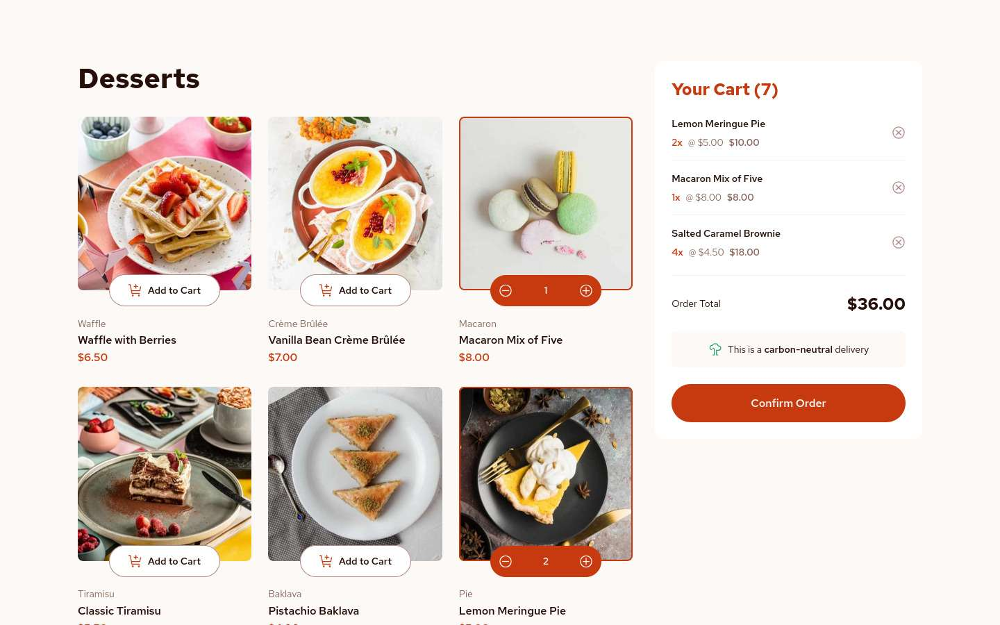
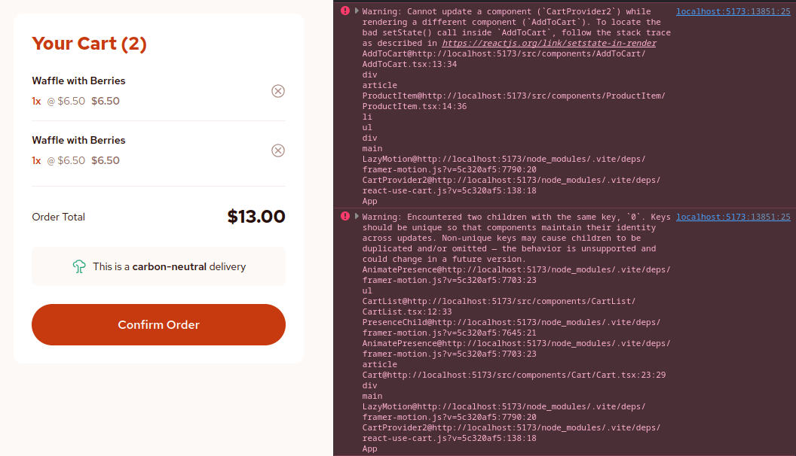

# Frontend Mentor - Product list with cart solution

This is a solution to the [Product list with cart challenge on Frontend Mentor](https://www.frontendmentor.io/challenges/product-list-with-cart-5MmqLVAp_d). Frontend Mentor challenges help you improve your coding skills by building realistic projects.

## Table of contents

- [Overview](#overview)
  - [The challenge](#the-challenge)
  - [Screenshot](#screenshot)
  - [Links](#links)
- [My process](#my-process)
  - [Built with](#built-with)
  - [What I learned](#what-i-learned)
  - [Continued development](#continued-development)
  - [Useful resources](#useful-resources)
- [Author](#author)
<!-- - [Acknowledgments](#acknowledgments) -->

## Overview

### The challenge

Users should be able to:

- [x] Add items to the cart and remove them
- [x] Increase/decrease the number of items in the cart
- [x] See an order confirmation modal when they click "Confirm Order"
- [x] Reset their selections when they click "Start New Order"
- [x] Navigate the whole project and perform all actions using only their keyboard
- [x] View the optimal layout for the interface depending on their device's screen size
- [x] See hover and focus states for all interactive elements on the page

### Screenshot

### Links

- Solution URL: TBD
- Live Site URL: https://product-list-with-cart.pages.dev/
- Storybook: TBD

## My process

### Built with

- [React](https://reactjs.org/) 🤝 [TypeScript](https://www.typescriptlang.org/)
- [Storybook](https://storybook.js.org/) - For practicing Component Driven Development
- [Framer Motion](https://www.framer.com/motion/) - Animation library for React
- [react-use-cart](https://github.com/notrab/react-use-cart) - Lightweight hook library for managing cart state
- [vite-plugin-svg-spritemap](https://github.com/SpiriitLabs/vite-plugin-svg-spritemap) - Vite plugin to generate svg spritemap
- [ESLint](https://eslint.org/) - Code linter and formatter

### What I learned

My biggest learning for this project would be using Storybook to design the components in isolation. It helped me put more thought into building components: when to make one, how to handle data fetching, etc. I also learned about the distinction between [presentational and container components](https://medium.com/@dan_abramov/smart-and-dumb-components-7ca2f9a7c7d0), which seems to be the [favored design pattern for Storybook](https://storybook.js.org/docs/writing-stories/build-pages-with-storybook#pure-presentational-pages), and some tradeoffs that come with choosing such a pattern.

Working this way seems slower (especially since it's my first time) but I feel more confident that my code works. I also had a much easier time when it came to coding the actual app, because I already had my components built and it's just a matter of laying them out on the page.

I also gave Framer Motion a try and added some simple animations to the modal and cart items when they show up on the screen. To [reduce bundle size](https://www.framer.com/motion/guide-reduce-bundle-size/), I used the `m` and `LazyMotion` components since I'm not using other features like layout animations and drag gesture. (Btw, I tried experimenting with layout animations for the cart component, but it looked weird, so I just removed it for now.)

I also decided to build my own Modal component using a portal to render the modal as a child of `document.body`. I used the native `dialog` element which comes with the built-in `showModal()` and `close()` methods for opening and closing the modal. That said, I think the implementation can be improved especially in terms of the timing of the animations.

Lastly, I discovered a great plugin called [vite-plugin-svg-spritemap](https://github.com/SpiriitLabs/vite-plugin-svg-spritemap) which is a great alternative for using SVG icons over [importing them as JSX](https://x.com/_developit/status/1382838799420514317).

### Continued development

I'm having a weird error in `StrictMode`: when removing an item from the cart, adding it immediately after would cause the same item to get added in the cart twice. This causes a warning that two children have the same key.

I spent some time debugging this issue but I can't seem to find the cause. Fortunately, this error doesn't show up in production, but I'll take it as a point of improvement in terms of writing pure components/functions.

### Useful resources

- [Speeding up the JavaScript ecosystem - The barrel file debacle](https://marvinh.dev/blog/speeding-up-javascript-ecosystem-part-7/) - I've been using barrel files consistently in my recent projects, but this article might be a reason to consider otherwise. Stumbled upon in [this Reddit thread](https://www.reddit.com/r/reactjs/comments/17i3a1p/what_is_the_benefit_of_the_indextsx_naming/).
- [css - Pseudo line between list elements?](https://stackoverflow.com/a/42810650) - I got the idea for my implementation of the horizontal separator between cart/order items from this StackOverflow answer.

## Author

- Website - [Josh Javier](https://joshjavier.com/)
- Frontend Mentor - [@joshjavier](https://www.frontendmentor.io/profile/joshjavier)
- Twitter - [@joshjavierr](https://www.twitter.com/joshjavierr)
- LinkedIn - [Josh Javier](https://www.linkedin.com/in/joshjavier/)

<!-- ## Acknowledgments

This is where you can give a hat tip to anyone who helped you out on this project. Perhaps you worked in a team or got some inspiration from someone else's solution. This is the perfect place to give them some credit.

**Note: Delete this note and edit this section's content as necessary. If you completed this challenge by yourself, feel free to delete this section entirely.** -->
